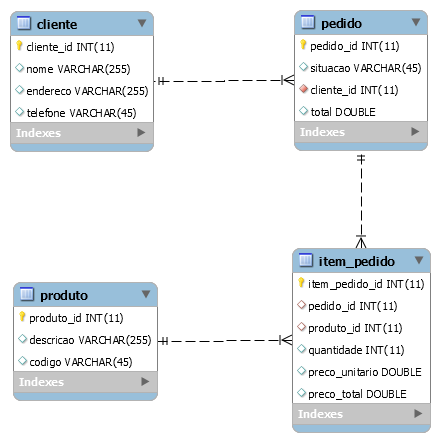

# Atividade ITE002

Exercício realizado na FATEC SJC :school:  

# Instruções

- Vale 2 pontos na nota do primeiro bimestre; e
- Pode ser realizado em grupo.

Crie uma aplicação com:

- 1º: No mínimo, 2 entidades relacionadas (usar um relacionamento @OneToMany),
mapeadas como tabelas (não utilizar as do exemplo);
- 2º: Uma das tabelas deve, além da chave primária, possuir uma chave única (uma coluna que não aceita valores iguais para registros diferentes);
- 3º: Um repositório para cada entidade criada com pelo menos 2 consultas: uma com query method e outra com @Query. Ambas as consultas devem envolver
mais de uma classe persistida (tabela);
- 4º: No mínimo, 1 serviço que utilize as duas entidades e faça uso de transações.
Um serviço deve receber parâmetros e/ou retornar dados. Um serviço deve conter as regras de negócio da aplicação;
- 5º: Todas as dependências injetadas utilizando Spring; e
- 6º Um programa principal que realize cadastros e consultas, por meio do(s) serviço(s). O programa principal não deve utilizar repositórios.

## Proposta de Projeto :pizza: :wine_glass: :yum:

O projeto trata-se de uma pizzaria onde o cliente poderá realizar pedidos.

Considerado o seguinte diagrama de Banco de Dados:




- 1º: Foi realizado relacionamento de Cliente com Pedido(@ManyToOne), ItemPedido com Pedido(@ManyToOne) e ItemPedido com Produto (@ManyToOne). :heavy_check_mark:
- 2º: Utilizado atributo codigo na tabela de Produto como chave única. :heavy_check_mark:
- 3º: Consultas realizadas nos Repositórios de Produto, Pedido :heavy_check_mark:
- 4º: Criado Serviço que cadastra vários produtos :heavy_check_mark:
- 5º: OK :heavy_check_mark:
- 6º: OK :heavy_check_mark:

## Instalação

- Realizar o clone do projeto ou apenas o download:

```git
git clone https://github.com/karenyov/AtividadeITE002.git
```

- Importar para sua IDE(Eclipse ou outra).

- Fazer o download das dependências (no Eclipse: botão direito no projeto Maven > Update Project...)

## Configurações

- Alterar as configurações do Banco de Bados em applicationContext.xml.

> obs: Caso as tabelas não sejam criadas automaticamente, foi deixado um arquivo chamado resources/import.sql, é só executá-lo.

## Rodando o Projeto

Para rodar o projeto basta executar a Classe App em br.gov.sp.fatec.App. 😆


